# Hi, I'm Sandeep 👋

### Aspiring Data Analyst | AI & ML Enthusiast

I am learning **Data Analytics, Python, SQL, and Machine Learning**.
I enjoy working with data and building small projects.

## 📊 Skills

- Python
- SQL
- Pandas
- NumPy
- Matplotlib
- Seaborn
- Excel
- Power BI
- Machine Learning
- Data Visualization

## 📚 Currently Learning

Python → SQL → Pandas → Statistics → Power BI → Machine Learning

## 📁 Projects

- Data Analysis Projects
- Python Projects
- SQL Projects
- Machine Learning Projects

## 🎯 Goal

To become a skilled **Data Analyst** and grow in the field of **Data Science and AI**.

### Tools
- ## 🛠️ Skills & Learning Journey

### 🐍 Python

### 🗄️ SQL

### 🐼 Pandas

### 📈 Statistics

### 📊 Power BI

### 🤖 Machine Learning

### 📁 Projects

### 🎯 Interview Preparation

### 🔧 Tools

---
## 🔥 GitHub Streak

---

## 💻 Most Used Languages

---

## 📈 My Goals

- 💡 Become a skilled Data Analyst
- 📊 Build real-world Data Analytics projects
- 🤖 Learn Machine Learning deeply
- 🧠 Improve Python & SQL skills
- 🚀 Contribute to open-source projects

---

## 🤝 Connect With Me

📧 Email:nidigallusandeep@gmail.com

💼 LinkedIn: https://www.linkedin.com/in/sandeepnidigallu

---

⭐ **Thanks for visiting my profile!**

### 🚀 Keep Learning | Keep Building | Keep Growing
